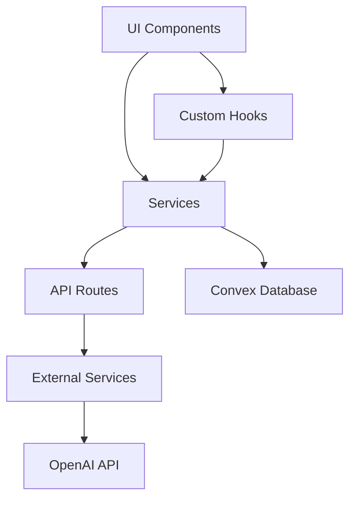
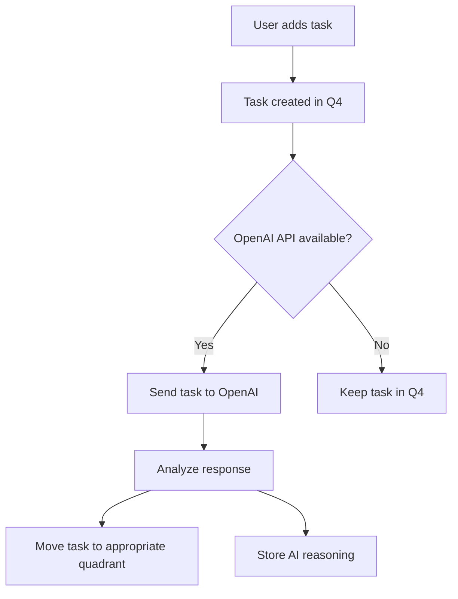
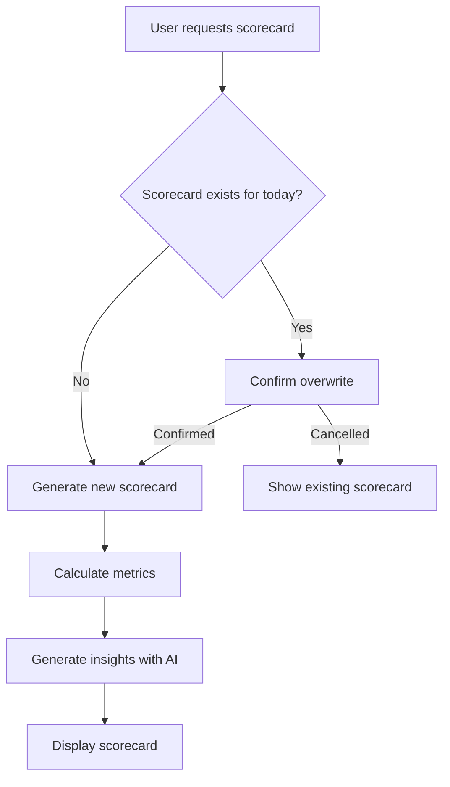
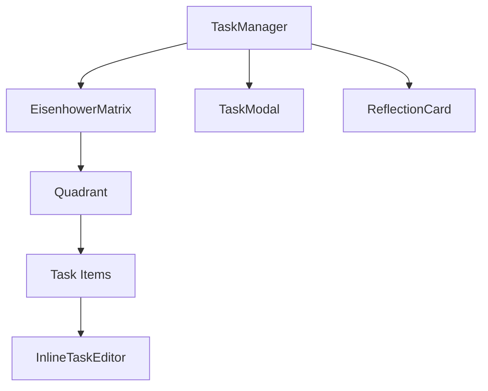
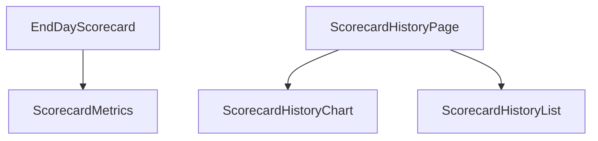

# System Patterns

## Architecture Overview

GSDApp follows a modern Next.js application architecture with a clear separation of concerns:



## Key Technical Decisions

1. **Next.js App Router**: Using the latest Next.js app router for routing and server components.
2. **Convex Database**: Selected for real-time data synchronization and simplified backend development.
3. **Clerk Authentication**: Chosen for robust auth capabilities and easy integration with Next.js.
4. **AI Integration**: OpenAI API for task analysis and categorization.
5. **Zustand for State Management**: Lightweight state management for UI state.
6. **Shadcn UI Components**: Built on Radix UI primitives for accessible, customizable UI components.

## Design Patterns

### Component Architecture

1. **Atomic Design Principles**: 
   - UI components are organized from simple to complex (atoms → molecules → organisms)
   - Base UI components in `/components/ui`
   - Feature-specific components in dedicated directories

2. **Container/Presentation Pattern**:
   - Container components handle logic and state (e.g., `TaskManager`)
   - Presentation components focus on rendering (e.g., `EisenhowerMatrix`)

3. **Custom Hooks for Logic Encapsulation**:
   - `useTaskManagement`: Core task CRUD operations
   - `useReflectionSystem`: Task reflection functionality
   - `useIdeasManagement`: Ideas management
   - `useScorecard`: Scorecard generation and management

### State Management

1. **Local Component State**: For UI-specific state (React's useState)
2. **Zustand Stores**: For shared application state
3. **Convex for Data Persistence**: For database operations and real-time updates

### Event-Driven Communication

The application uses a custom event system for cross-component communication:

```typescript
// Event dispatch pattern
const dispatchAIEvent = <T extends AIEventType>(eventType: T, detail: AIEventDetail[T]) => {
  const event = new CustomEvent(eventType, { detail });
  window.dispatchEvent(event);
};

// Event listening pattern
useEffect(() => {
  window.addEventListener('aiThinkingChanged', handleAIThinkingChanged);
  return () => window.removeEventListener('aiThinkingChanged', handleAIThinkingChanged);
}, [handleAIThinkingChanged]);
```

## Critical Implementation Paths

### Task Creation and AI Analysis Flow



### Scorecard Generation Flow



### Task Drag and Drop Implementation

The Eisenhower Matrix implements a custom drag and drop system for:
1. Reordering tasks within a quadrant
2. Moving tasks between quadrants

This is implemented with native HTML5 drag and drop API rather than a library to maintain fine-grained control over the interaction.

## Component Relationships

### Task Management Hierarchy



### Scorecard System


